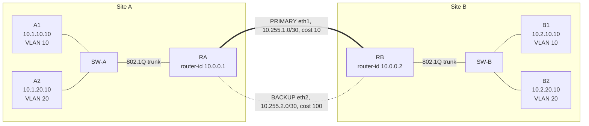

# Network Failover Test Lab

[](https://github.com/kocembaw/network-failover-test-lab/actions/workflows/ci.yml)

A two-site routed network built in **GNS3**, with a **manual system test plan** for connectivity, failover and recovery.

- **Network:** two sites, each with a router (FRRouting), a switch with two VLANs and Linux hosts. The sites are joined by a primary and a backup WAN link and run OSPF.
- **Testing:** 12 test cases traced to 9 requirements, executed by hand, with evidence (probe logs, router state, Wireshark captures) for every run.
- **Tooling:**
  - `inject-failure.sh` makes failures repeatable.
  - `failover-probe` measures how long traffic is lost, to 0.1 s.
  - CI validates router configs and tools on every push.

## Topology



| Segment | Subnet | Gateway / addresses |
|---|---|---|
| Site A, VLAN 10 Users | 10.1.10.0/24 | RA `eth0.10` .1, A1 .10 |
| Site A, VLAN 20 Servers | 10.1.20.0/24 | RA `eth0.20` .1, A2 .10 |
| Site B, VLAN 10 Users | 10.2.10.0/24 | RB `eth0.10` .1, B1 .10 |
| Site B, VLAN 20 Servers | 10.2.20.0/24 | RB `eth0.20` .1, B2 .10 |
| WAN primary | 10.255.1.0/30 | RA `eth1` .1, RB `eth1` .2, OSPF cost 10 |
| WAN backup | 10.255.2.0/30 | RA `eth2` .1, RB `eth2` .2, OSPF cost 100 |
| Loopbacks | 10.0.0.1/32, 10.0.0.2/32 | RA, RB |

The routers do inter-VLAN routing over an 802.1Q trunk (router-on-a-stick). OSPF runs in area 0. The WAN links are point-to-point, and user VLANs are passive.

## What is tested

| ID | Test case | Area |
|---|---|---|
| TC-01 | OSPF adjacencies are established on both WAN links | Connectivity |
| TC-02 | Primary WAN link is preferred | Connectivity |
| TC-03 | Inter-VLAN routing within a site | Connectivity |
| TC-04 | End-to-end connectivity between sites | Connectivity |
| TC-05 | 1500-byte packets cross the WAN without fragmentation | Connectivity |
| TC-06 | OSPF is not sent on user VLANs | Connectivity |
| TC-07 | Failover after primary link loss of carrier | Failover |
| TC-08 | Failover after silent primary link failure | Failover |
| TC-09 | Established TCP session survives failover | Failover |
| TC-10 | Hosts are notified when no path exists | Failover |
| TC-11 | Traffic returns to the primary link after restoration | Recovery |
| TC-12 | Site router recovers after reboot without manual steps | Recovery |

- Requirements, approach and entry/exit criteria: [test-plan/TEST_PLAN.md](test-plan/TEST_PLAN.md)
- Steps and expected results: [test-plan/TEST_CASES.md](test-plan/TEST_CASES.md)
- Test run reports and evidence: [results/](results/)
- Defects: [GitHub Issues labelled `defect`](https://github.com/kocembaw/network-failover-test-lab/issues?q=label%3Adefect)

## Repository layout

```
configs/            FRR configs and VLAN lists for RA/RB, interface files for hosts
images/router/      Router image: FRRouting + start script + lab-evidence
images/host/        Host image: Alpine + iputils, iperf3, tcpdump, failover-probe
scripts/            build-images.sh, inject-failure.sh, fetch-evidence.sh
tools/              failover_probe.py and its unit tests
test-plan/          Test plan and test cases
results/            Run reports and evidence
docs/               GNS3 setup guide, evidence guide
```

## Getting started

1. Build the lab in GNS3: [docs/setup-gns3.md](docs/setup-gns3.md).
2. Run TC-01 as a smoke test, then the remaining test cases in order.
3. Record each run in `results/` and log defects as issues: [docs/evidence.md](docs/evidence.md).

## Tools

| Tool | Where it runs | What it does |
|---|---|---|
| `failover-probe run <ip>` | lab hosts | Pings every 100 ms, reports every outage and its length, and checks a pass/fail threshold |
| `failover-probe analyze <log>` | anywhere with Python 3 | Re-analyses a saved probe log |
| `scripts/inject-failure.sh hard\|silent\|isolate\|restore\|status` | GNS3 VM | Injects WAN failures on both routers at once and logs a UTC timestamp |
| `lab-evidence [label]` | routers | Snapshot of interfaces, OSPF neighbours, routes and recent OSPF log |
| `scripts/fetch-evidence.sh <run-id>` | GNS3 VM | Copies logs and router state into `results/evidence/<run-id>/` |

## CI

On every push, GitHub Actions:

- validates both router configs with `vtysh --dryrun`;
- lints the shell scripts with ShellCheck;
- runs the `failover-probe` unit tests;
- builds both Docker images and smoke-tests that FRR starts with the right config.
